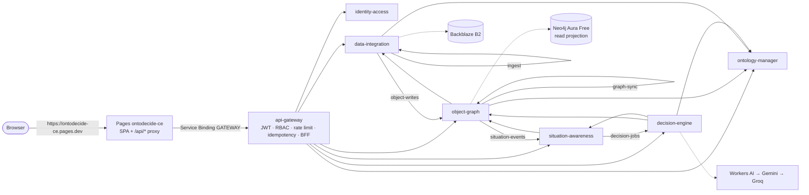

# OntoDecide CE

> Ontology-driven decision intelligence — data → situation → decision → action → feedback — running entirely on free-tier infrastructure.

OntoDecide unifies data from ERP / WMS / TMS / IoT exports into an **ontology** of objects, properties and links. On top of that model it offers:

* a real-time operations cockpit;
* deterministic what-if simulation;
* AI recommendations that stay inside an action whitelist and come with an evidence chain;
* human approval that writes actions back to the business systems.

The first scenario pack is **supply chain risk monitoring**.

Design documents (V1.3): 总体设计说明书 · 详细设计说明书 · 前端详细设计说明书. [`docs/ARCHITECTURE.md`](docs/ARCHITECTURE.md) maps them onto this repository.

## Architecture



The system is 1 Pages project plus 7 Workers. Each business Worker owns exactly one D1 database, and every Worker has `workers_dev: false`: the only public entry point is the Pages domain.

| Worker | Bounded context | Owns |
| --- | --- | --- |
| `api-gateway` | — (technical) | EdgeGuard DO (idempotency, precise rate limits), KV `api-gateway-config` |
| `identity-access` | Identity (generic) | D1 `identity-access-db` |
| `ontology-manager` | Ontology (core) | D1 `ontology-manager-db`, KV `ontology-schema-cache` |
| `data-integration` | Integration (supporting) | D1 `data-integration-db`, B2 `ontodecide-ce-raw-*`, queue `ingest` |
| `object-graph` | ObjectGraph (core) | D1 `object-graph-db`, Neo4j projection, queue `graph-sync` |
| `situation-awareness` | Situation (supporting) | D1 `situation-awareness-db`, DOs `SituationRoom` + `UsageGuard`, all DLQs |
| `decision-engine` | Decision (core) | D1 `decision-engine-db`, Workers AI, Vectorize `decision-cases-bge-m3` |

## Repository layout

Layout and naming follow Google TypeScript style (`gts`).

```
apps/<worker>/          wrangler.jsonc.tpl + src/{env,container,service,index}.ts
apps/web/               React 19 SPA, Pages Functions proxy, Playwright e2e
packages/shared-kernel/ CallCtx, Rid, DomainEvent, AppError/Problem, FilterExpr, JSONLogic, JWT, crypto
packages/<context>/     contract/ domain/ application/ infrastructure/ interface/
packages/testing/       D1 over node:sqlite, DO SQL storage, KV, queues with DLQ, RPC binding fakes
migrations/<db>/        D1 migrations (one directory per database)
infra/                  Terraform: D1, KV, Queues, B2, Pages project, Neo4j Aura
scripts/                gen_wrangler.mjs, dev.sh, smoke.mjs, bootstrap.sh
samples/supply-chain/   demo CSVs for the built-in pack
tests/e2e/              in-process full-loop test through the gateway
```

## Getting started

Requirements: Node.js ≥ 22.13 (for `node:sqlite` in tests), pnpm 9, and Terraform ≥ 1.10 if you manage infrastructure.

```bash
corepack enable && pnpm install
pnpm typecheck && pnpm lint && pnpm test     # everything runs offline
pnpm dev                                     # 7 workers on :8787 (local D1/KV/DO/Queues) + web on :5173
pnpm smoke                                   # drives the full loop over HTTP against pnpm dev
```

Local login is `admin@ontodecide.local` / `Admin12345!`. The bootstrap admin is created on the first login against an empty database.

Once logged in, a first walkthrough:

1. **Ontology** → import the *Supply chain* pack.
2. **Sources** → create three file sources and upload `samples/supply-chain/*.csv`.
3. Watch the **cockpit** update.
4. Upload a supplier row with `riskScore ≥ 70`. A HIGH alert appears, followed by an AI recommendation.
5. Approve it in **Recommendations**.

## Deployment

There is a single environment, **production** (GitHub environment `production`); resources are created and services deployed only from `main`. Terraform manages resources and Wrangler manages code. Each kind of configuration has exactly one source of truth, and the Cloudflare dashboard is read-only.

| What | Source of truth | Tool |
| --- | --- | --- |
| D1, KV, Queues, B2 bucket + key, Pages project, Neo4j Aura | `infra/*.tf` | Terraform (state in B2 `ontodecide-ce-tfstate`) |
| Worker bindings, vars, crons, DO migrations, queue consumers | `apps/*/wrangler.jsonc.tpl` | `scripts/gen_wrangler.mjs` renders ids from `terraform output -json` |
| Pages binding (`GATEWAY` → `api-gateway`) | `apps/web/wrangler.jsonc` | `wrangler pages deploy` |
| D1 schema | `migrations/<db>/*.sql` | `wrangler d1 migrations apply` |
| Secrets | GitHub Secrets | `wrangler secret bulk` |
| Vectorize index | `scripts/bootstrap.sh` | wrangler (idempotent) |

The workflows run as one chain on `main`, each started by the previous one finishing, so services never deploy before the infrastructure for the same commit is applied:

```
push to main → CI → Terraform → Deploy
```

* **`ci.yml`** runs typecheck, lint (gts + dependency-cruiser), tests, the web build with the 250 KB bundle budget, and Worker dry-run bundles.
* **`terraform.yml`** runs Format → Validate → Lint → Plan → Apply. Format, Validate, Lint and Plan run on every PR and on `main` (after every green CI run). Apply runs **only on `main`**, only when the plan has changes, and only after a reviewer approves the `production` environment. A nightly run checks for drift.
* **`deploy.yml`** runs Build (production configs rendered from Terraform outputs, Worker dry-run bundles, web build) on every PR and on `main`. Deploying happens **only on `main`**, after Terraform succeeds (or manually): after one approval on the `production` environment, each service deploys (migrations → deploy → secrets) in its own job, and a job waits for the services it binds to:

  ```
  ontology-manager ──► data-integration ──► object-graph ──► situation-awareness ──► decision-engine ──► api-gateway ──► Pages
  identity-access  ─────────────────────────────────────────────────────────────────────────────────────┘
  ```

**Secrets:** `CF_API_TOKEN`, `CF_ACCOUNT_ID`, `B2_MASTER_KEY_ID/KEY`, `B2_STATE_KEY_ID/KEY`, `NEO4J_AURA_CLIENT_ID/SECRET`, `JWT_SECRET` (`kid:secret[,kid:secret]`), `APPROVAL_SECRET`, `WRITEBACK_SECRET`, `CONNECTOR_ENC_KEY`, `BOOTSTRAP_ADMIN_PASSWORD`, and optionally `GEMINI_API_KEY` / `GROQ_API_KEY`.

**Variable:** `BOOTSTRAP_ADMIN_EMAIL`.

## Free-tier guardrails

* **UsageGuard** counts daily usage per resource. It warns at 80%; at 95% it pauses non-critical writes (QUOTA_EXCEEDED 503), while reads and approvals still work.
* **D1 writes** are kept down in two ways. Writes are skipped when the props hash is unchanged. Each write batch produces one aggregated situation event.
* **Degradation paths:**
  * Neo4j unavailable → 2-hop D1 traversal, with `degraded: true` in the response.
  * LLM chain exhausted → rule-based recommendations.
  * WebSocket down → 30-second polling.
* **Per-call limits** keep each invocation within the 10 ms CPU budget:
  * the browser parses files;
  * each ingest message carries at most 50 records;
  * simulation is capped at 500 nodes and 3 hops.

## License

Private, closed-source project © OntoDecide Team

For licensing or business inquiries, please contact the project maintainers.
