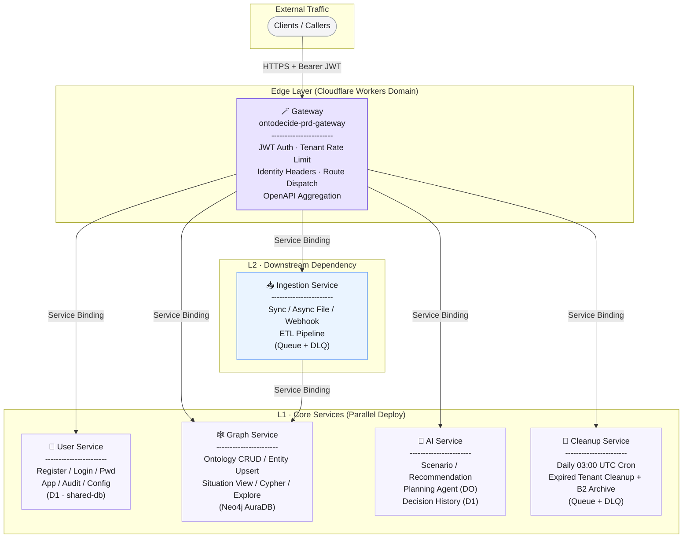
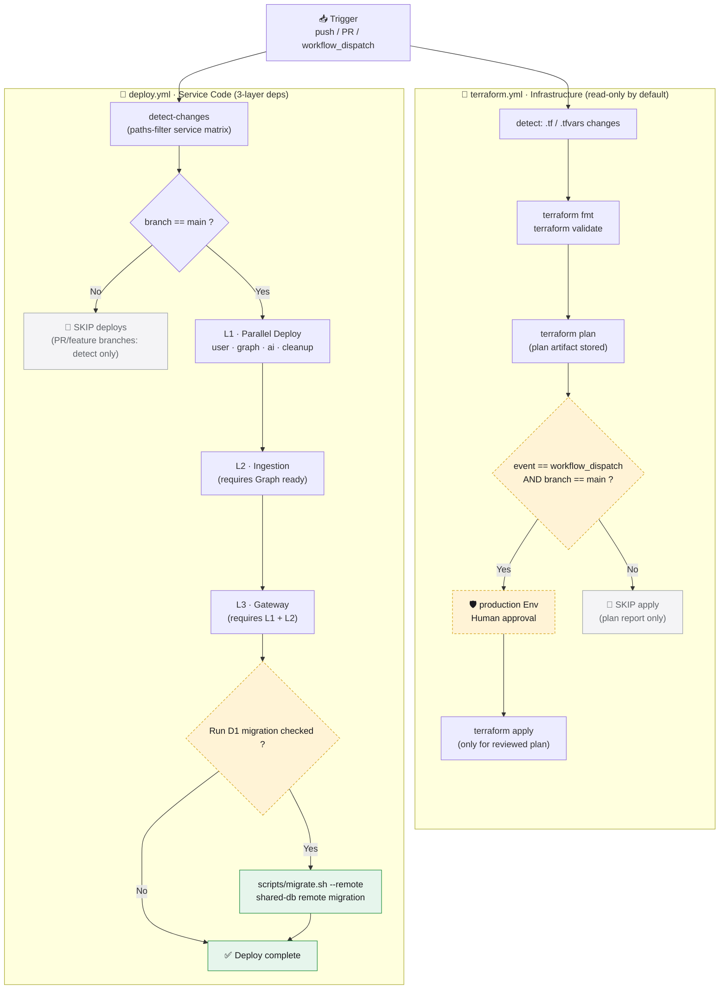

# OntoDecide

> Ontology-driven data fusion for smarter, real-time decisions.

OntoDecide is a multi-tenant intelligent decision platform built on Cloudflare Workers + Neo4j. It unifies heterogeneous data sources through ontology modeling, with built-in AI scenario simulation, recommendations and planning agents, so teams can make better decisions faster in the flood of information.

---

## Table of Contents

- [Background](#background)
- [Architecture](#architecture)
- [Features](#features)
- [Install](#install)
- [Getting Started](#getting-started)
- [Configuration](#configuration)
- [API Reference](#api-reference)
- [Deployment](#deployment)
- [Development](#development)
- [Maintenance](#maintenance)
- [License](#license)

---

## Background

Enterprise data is typically scattered across CRM, ERP, ticketing systems, logs, documents and more, and decisions are often based on manual stitching and gut feel. OntoDecide solves this with five pillars:

1. **Ontology Modeling** — a unified type system (Ontology + Entity + Relation) that represents business concepts.
2. **Heterogeneous Ingestion** — sync APIs, async files and webhooks to pull data from any source.
3. **Graph Storage** — Neo4j-backed entity and relationship store with graph queries and situation views.
4. **AI Decision Augmentation** — multi-LLM provider access for scenario simulation, recommendations and autonomous planning agents.
5. **Multi-tenant Isolation** — end-to-end tenant data safety, from Gateway authentication through Graph `tenant_id` property isolation and periodic cleanup.

---

## Architecture

### Services Overview (Microservices + Service Bindings)



> **Call Direction**: Gateway is the only public entrypoint. All downstream services exclusively accept Service Binding calls from the Gateway (and Ingestion → Graph). No public routes are exposed.

| Service | Package | Responsibility |
| ------- | ------- | -------------- |
| **Gateway** | `@ontodecide/gateway` | JWT authentication, tenant rate limits, identity header injection, request forwarding (Service Bindings), OpenAPI aggregation |
| **User** | `@ontodecide/user` | User signup, login, password management, account applications, user CRUD, audit log, configuration hub |
| **Graph** | `@ontodecide/graph` | Ontology type CRUD, entity & relation upsert, situation views, Cypher queries, graph exploration |
| **Ingestion** | `@ontodecide/ingestion` | Sync / async / file / webhook ingestion, ETL pipeline, Queue-based decoupling |
| **AI** | `@ontodecide/ai` | Unified multi-provider LLM access (Google / Groq / Workers AI), scenario simulation, recommendations, planning agent (Durable Object) |
| **Cleanup** | `@ontodecide/cleanup` | Daily Cron-driven expired tenant cleanup (D1 + Neo4j + B2 archive) |
| **Shared** | `@ontodecide/shared` | Shared DTOs, Zod schemas, Drizzle schema, constants, JWT / crypto helpers, Hono helpers, B2 client |

### Core Infrastructure

| Component | Technology | Description |
| --------- | ---------- | ----------- |
| Serverless Runtime | **Cloudflare Workers** | 6 microservices interconnected via Service Bindings — no public internet egress costs |
| Relational / Structured Store | **Cloudflare D1** | `shared-db` database: users, applications, decision history, audit log, configuration |
| Graph Database | **Neo4j AuraDB** | Shared instance with `tenant_id` property-level isolation; `DETACH DELETE` for expired tenants |
| Ephemeral / Counter Store | **Cloudflare KV** | JWT blacklist, rate limit counters, per-service caches |
| Async Queues | **Cloudflare Queues** | Ingestion file intake and Cleanup execution queues (with DLQs) |
| Object Storage | **Backblaze B2** | 2 buckets: ingestion staging and tenant archive backup |
| AI Gateway | **Cloudflare AI Gateway** | Single entry point for all LLM calls, with built-in caching and budget governance |
| IaC | **Terraform** | Manages long-lived resources (D1, KV, Queue, Service Bindings, Cron, Domains) |
| CI/CD | **GitHub Actions** | `deploy.yml` (code deploys) + `terraform.yml` (infrastructure) |

---

## Features

### 🔐 Identity & Multi-tenancy
- Email-as-username with JWT Access + Refresh dual-token model
- Forced password rotation on first login; KV-backed token blacklist for explicit logout
- Gateway injects `x-tenant-id` / `x-user-id` / `x-user-role` — downstream services trust headers without holding secrets
- Account application → admin approval workflow

### 🕸️ Ontology & Graph
- Define Ontology types (attribute schemas)
- Atomic Upsert, query and delete of entities & relationships
- "Situation View" for any entity — aggregated neighbourhood relations
- Graph exploration (root + depth + direction) and admin-level Cypher queries

### 📥 Data Ingestion
- `POST /api/ingest/sync` — small-payload synchronous ETL
- `POST /api/ingest/file` — large-file async enqueue to Queue
- `POST /api/ingest/webhook` — signature-verified callbacks
- Job status lookups

### 🤖 AI Decision Augmentation
- **Scenario Simulation** (`/api/ai/scenario`) — multi-branch scenarios with outcome evaluation, generated from any input
- **Smart Recommendations** (`/api/ai/recommend`) — Top-N recommendations grounded on the graph and historical decisions
- **Planning Agent** (`/api/ai/agent/*`) — Durable Object driven long-running tasks: planning, reflection, state tracking
- **Decision History** (`/api/ai/history`) — paginated access to all AI decision artifacts
- Unified Provider abstraction: Google AI Studio / Groq as priority, Cloudflare Workers AI as always-available fallback

### 🧹 Data Lifecycle
- Cleanup Worker triggered daily by Cron at 03:00 UTC
- Expired tenants: D1 soft-delete + Neo4j `DETACH DELETE` + B2 archive backup
- Admins can manually trigger cleanup and track task status

---

## Install

### Requirements

| Tool | Version | Notes |
| ---- | ------- | ----- |
| **Node.js** | `>= 22` | CI pins Node 22; also set `NODE_VERSION=22` in Cloudflare Dashboard env vars |
| **pnpm** | `>= 9.12.0` | Enable via corepack: `corepack enable && corepack prepare pnpm@9.12.0 --activate` |
| **wrangler** | `^4.125` | Comes via devDependencies (`pnpm exec wrangler`) |
| **Terraform** | `~> 1.9` | Only required for infrastructure management |

### Clone & Install Dependencies

```bash
git clone <your-repo-url>
cd ontodecide
corepack enable
pnpm install
```

---

## Getting Started

### 1. Prepare Environment Variables

```bash
cp .env.example .env
# Edit .env — at minimum fill in CLOUDFLARE_*, NEO4J_*, and JWT_SECRET
```

Generate a high-entropy JWT secret:

```bash
openssl rand -hex 32
```

### 2. Initialize Infrastructure (one-time)

```bash
# 1. Export Cloudflare and Backblaze B2 credentials
export CLOUDFLARE_API_TOKEN=<your-token>
export TF_VAR_account_id=<cf-account-id>
export AWS_ACCESS_KEY_ID=<B2_KEY_ID>
export AWS_SECRET_ACCESS_KEY=<B2_KEY>

# 2. Terraform provision resources (D1 / KV / Queues / Worker Skeletons / Bindings / Cron)
cd infrastructure/terraform
cp terraform.tfvars.example terraform.tfvars   # edit environment-specific values
terraform init
terraform plan
terraform apply    # Recommended: run via GitHub Actions with human review before apply
```

### 3. Backfill KV / D1 IDs into each service `wrangler.toml`

```bash
# Method 1: use helper scripts
bash scripts/resolve-kv-ids.sh
bash scripts/resolve-d1-ids.sh

# Method 2: manual — fetch IDs from terraform output or Cloudflare Dashboard
# and replace placeholders like id = "REPLACE_WITH_TERRAFORM_CREATED_KV_*_ID" in wrangler.toml
```

### 4. Local Development

```bash
# Back to repository root
pnpm dev          # Turbo starts all Workers in parallel (wrangler dev --local)
pnpm test         # Run all vitest unit tests
pnpm typecheck    # tsc --noEmit type check
pnpm lint         # ESLint
```

Gateway listens on `http://localhost:8787`; Swagger UI is available at `http://localhost:8787/docs`.

---

## Configuration

### Environment Variables (.env / CI Secrets)

See `.env.example` and each service's `wrangler.toml` `[vars]` / Secrets sections for full details.

| Variable | Distributed To | Description |
| -------- | -------------- | ----------- |
| `CLOUDFLARE_ACCOUNT_ID` | Local + CI | 32-hex-char Account ID |
| `CLOUDFLARE_API_TOKEN` | Local + CI | Wide-scope API token (for deploys) |
| `NEO4J_URL` | Graph / Cleanup | Accepts `neo4j+s://` and `https://` (AuraDB) |
| `NEO4J_USER` | Graph / Cleanup | Defaults to `neo4j` |
| `NEO4J_PASSWORD` | Graph / Cleanup (Secret) | Neo4j password |
| `JWT_SECRET` | Gateway / User (Secret) | ≥32 char high-entropy random string; 5-tier strength validation |
| `B2_KEY_ID` / `B2_KEY` | Ingestion / Cleanup (Secret) / TF State | Backblaze B2 Application Key |
| `GOOGLE_API_KEY` / `GROQ_API_KEY` | AI (Secret, optional) | LLM provider keys; Workers AI needs no key |
| `EMAIL_API_KEY` | User (Secret) | Email delivery (initial password, password reset, etc.) |
| `*_SERVICE_URL` | Local dev (optional) | HTTP fallback URL when a Service Binding is not available |

### Config Validation

Each Worker runs `validateAndLogConfig()` on first request (`apps/shared/src/utils/validate-config.ts`):
- Declarative `REQUIRED_KEYS` / `OPTIONAL_KEYS` definitions
- Built-in dedicated validators: `validators.jwtSecret()`, `validators.neo4jUrl()`, `validators.url()`, etc.
- WARN / ERROR findings are explicitly surfaced via `wrangler tail` logs; never blocks a deploy, but eases debugging.

---

## API Reference

All APIs conform to the **OpenAPI 3.0** standard. After deployment, access them through the Gateway:

- **Swagger UI**: `https://<gateway-domain>/docs`
- **Raw JSON**: `https://<gateway-domain>/openapi.json`
- Static snapshots committed in the repo: `docs/openapi/{gateway,user,graph,ingestion,ai,cleanup}.json`

Regenerate the aggregated spec (Gateway composes all downstream schemas):

```bash
node scripts/generate-openapi.mjs
```

### Endpoint Groups

| Tag | Prefix | Representative Actions |
| --- | ------ | ---------------------- |
| **Auth** | `/api/auth/*`, `/api/applications` | login / refresh / logout / change password / account application |
| **User** | `/api/user/*` | Current user profile |
| **Admin · Users** | `/api/admin/users/*` | List / Create / Toggle active / Reset password / Delete |
| **Admin · Audit** | `/api/admin/audit` | Paginated audit log |
| **Admin · Config** | `/api/admin/config` | List & update system configuration |
| **Admin · Cleanup** | `/api/admin/cleanup*` | Trigger & query cleanup tasks |
| **Ontology** | `/api/ontology` | Ontology type List / Upsert |
| **Entities** | `/api/entities*` | Entity CRUD + batch Upsert |
| **Situation** | `/api/situation/{id}` | Situation view for an entity |
| **Graph** | `/api/graph/explore`, `/api/graph/query` | Subgraph exploration, Cypher queries |
| **Ingestion** | `/api/ingest/*` | Sync / Async File / Webhook / Job Status |
| **AI** | `/api/ai/*` | Provider list / Scenario / Recommendation / Agent / History |

All authenticated endpoints require **`Authorization: Bearer <access_token>`**.

---

## Deployment

### Pipeline Overview



Key constraints:
- **Terraform apply runs ONLY on `workflow_dispatch` + main branch**; gated by manual approval in the `production` Environment
- **Code deploy auto-runs on main**; non-main branches run detect-changes without deploying
- Every Worker is deployed with `--config apps/api/<svc>/wrangler.toml` (the repo root `wrangler.toml` is intentionally empty)
- D1 migrations are triggered by the **optional checkbox only after all Workers deploy successfully** (prevents schema/code version skew)

### GitHub Secrets & Variables Inventory

> Full details in `infrastructure/terraform/README.md §3`.

| Kind | Name | Purpose |
| ---- | ---- | ------- |
| Secret | `CF_API_TOKEN` | Shared by code deploys + Terraform |
| Secret | `CF_ACCOUNT_ID` | Cloudflare Account ID |
| Secret | `JWT_SECRET` | Gateway + User |
| Secret | `NEO4J_PASSWORD` | Graph + Cleanup |
| Secret | `B2_KEY_ID` / `B2_KEY` | Ingestion / Cleanup / TF state backend |
| Secret | `EMAIL_API_KEY` | User |
| Secret | `GOOGLE_API_KEY` / `GROQ_API_KEY` | AI (optional) |
| Variable | `TF_ZONE_ID` | (Optional) Custom domain Zone ID |

### Manual Deploy (Emergency Only)

```bash
# 1. Build then deploy layer by layer
pnpm build
# L1
pnpm --filter=@ontodecide/user exec wrangler deploy --config apps/api/user/wrangler.toml
pnpm --filter=@ontodecide/graph exec wrangler deploy --config apps/api/graph/wrangler.toml
pnpm --filter=@ontodecide/ai exec wrangler deploy --config apps/api/ai/wrangler.toml
pnpm --filter=@ontodecide/cleanup exec wrangler deploy --config apps/api/cleanup/wrangler.toml
# L2
pnpm --filter=@ontodecide/ingestion exec wrangler deploy --config apps/api/ingestion/wrangler.toml
# L3
pnpm --filter=@ontodecide/gateway exec wrangler deploy --config apps/api/gateway/wrangler.toml

# 2. D1 migration (if needed)
bash scripts/migrate.sh --remote
```

---

## Development

### Project Structure

```
ontodecide/
├── apps/
│   ├── api/
│   │   ├── gateway/       # Auth · Rate Limit · Forward · OpenAPI Aggregation
│   │   ├── user/          # Users · Auth · Audit · Config (D1)
│   │   ├── graph/         # Ontology · Entity · Situation · Graph Query (Neo4j)
│   │   ├── ingestion/     # ETL · Sync/Async/Webhook · Queue Consumer
│   │   ├── ai/            # Multi-LLM · Scenario · Recommend · Agent (DO) · History (D1)
│   │   └── cleanup/       # Cron · Queue · Tenant data cleanup & archive
│   └── shared/            # Shared DTO · Schema · Utils · Drizzle · B2 · Hono Helpers
├── docs/openapi/          # Static openapi.json snapshot per service + gateway
├── infrastructure/
│   └── terraform/         # D1 / KV / Queue / Service Bindings / Cron / Domains
├── scripts/               # migrate.sh / resolve-*-ids.sh / generate-openapi.mjs
├── .github/workflows/
│   ├── ci.yml             # PR build · tests · typecheck
│   ├── deploy.yml         # Service deploys + optional D1 migration
│   └── terraform.yml      # fmt · validate · plan + (manual) apply
├── package.json
├── pnpm-workspace.yaml
├── turbo.json
├── tsconfig.base.json
├── vitest.config.ts
└── README.md
```

### Code Conventions

- **Stack**: Hono + Zod (`@hono/zod-openapi`) + Drizzle ORM + Vitest
- **Router Definition**: OpenAPI-first — `registry.registerPath({...})` serves as both types and docs
- **Inter-service Calls**: Gateway ↔ downstream and Ingestion → Graph all use **Service Bindings**; HTTP only as local fallback
- **Config Validation**: Each Worker declares `REQUIRED_KEYS` / `OPTIONAL_KEYS` at the top; unified `validateAndLogConfig` runs on first request
- **Error Envelope**: Uniform `{ ok, code, message, data }` shape (`jsonOkResponse` / `jsonFailResponse`)
- **Tests**: Vitest — see `apps/shared/tests` and the User service for examples

### Common Commands

```bash
pnpm build          # Turbo cached build
pnpm dev            # Start all services locally
pnpm test           # Run all unit tests
pnpm typecheck      # Full type check
pnpm lint           # ESLint
pnpm clean          # Remove dist & tsbuildinfo

# Single-service examples
pnpm --filter=@ontodecide/user test
pnpm --filter=@ontodecide/graph exec wrangler d1 migrations apply shared-db --local
```

### Adding a New Worker (Expansion Guide)

Three steps:
1. `infrastructure/terraform/main.tf` — add entries to `locals.workers`, `gateway_service_bindings`, and `kv_binding_map`
2. `.github/workflows/deploy.yml` — append a service entry to `DEFAULTS_MATRIX_JSON`
3. Create `apps/api/<new>/` (use `apps/api/graph` as the minimal template) with `src/index.ts`, `wrangler.toml`, `package.json`, and `tsconfig.json`

See `infrastructure/terraform/README.md §5` for the detailed walkthrough.

---

## Maintenance

### Troubleshooting Quick Reference

| Symptom | Common Cause | Fix |
| ------- | ------------ | --- |
| `wrangler deploy` reports missing KV binding | Terraform hasn't run, or `wrangler.toml` still has `REPLACE_WITH_*` placeholders | Run `terraform apply` first, then backfill IDs via `scripts/resolve-kv-ids.sh` |
| Queue not found on deploy | Queue resources are Terraform-owned; must be provisioned before deploy | Run `terraform apply` once |
| Service Binding target worker does not exist | Layered Tier1→2→3 dependencies must all be created successfully | Verify B2 remote state is wired; layered `depends_on` is preconfigured in TF |
| JWT validation fails | Secret fails ≥32 char / weak-key blacklist / insufficient char-class checks | Regenerate with `openssl rand -hex 32` |
| Neo4j connection fails | Disallowed `NEO4J_URL` protocol / AuraDB domain validation fails | Use protocols accepted by `validators.neo4jUrl()`; confirm allow-listed domains |
| wrangler-action secrets not injected | `secrets:` accepts secret **names** only, NOT `NAME=VALUE` | Use a plain name list; map values via job-level `env` |
| Terraform plan shows external diff on script | `wrangler deploy` overwrote the Terraform sentinel script | Intentionally ignored via `lifecycle.ignore_changes` — no action needed |

### Contributing

1. **No direct pushes to main**: every change must go through a Pull Request
2. PRs must pass `ci.yml` (build · typecheck · lint · tests) + `terraform.yml` plan
3. Follow the minimal-comments principle (`deploy.yml` is held to the 394-line baseline)
4. Prefer terse, clean config files; push complexity into code/scripts
5. Run `pnpm test && pnpm typecheck` locally before pushing

### Versioning & Releases

- Project version `0.1.0` (reported in `package.json` and Gateway `/healthz`)
- Workers are released independently; deploy order strictly L1 → L2 → L3
- D1 migration files follow the `0001_*.sql` increasing pattern and are never mutated retroactively

---

## License

Private, closed-source project © OntoDecide Team

For licensing or business inquiries, please contact the project maintainers.

