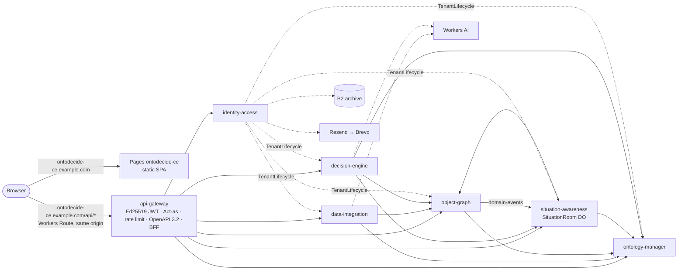

# OntoDecide CE

> Ontology-driven decision intelligence — import → fuse → situation → simulate → recommend → confirm → act — as a free public **Community Edition** running entirely on free tiers.

Anyone can sign up with an e-mail code (no password, no credit card) and gets **one workspace for a 72-hour trial**. The user is its only **Owner**. Inside the workspace they can:

* model an **ontology** of objects, properties, links and actions (starting from the shared *supply chain risk* template);
* import CSV / XLSX / JSON files (parsed in the browser) or load a sample scenario;
* watch a real-time **cockpit** (KPIs, trends, alerts);
* run deterministic **what-if** simulations;
* get **recommendations** that Workers AI ranks and explains, and execute them after confirming.

When the trial ends, the workspace data is packed into one ZIP in Backblaze B2. A download link valid for 7 days is e-mailed, and then the account, including the e-mail address, is deleted. The ZIP itself is deleted after 7 days. A single **bootstrap Admin** operates the platform. The Admin is system-unique, never expires, and cannot be deleted. It signs in with an e-mail code plus a passkey, and every one of its actions is audited.

Design documents (V2.4): 社区版设计修订说明书 (authoritative), 总体设计说明书, 详细设计说明书, 前端详细设计说明书. [`docs/ARCHITECTURE.md`](docs/ARCHITECTURE.md) maps them onto this repository; [`docs/ROLES.md`](docs/ROLES.md) describes Owner and Admin.

## Architecture


```mermaid
flowchart LR
  B([Browser]) -->|ontodecide-ce.example.com| P[Pages ontodecide-ce<br/>static SPA]
  B -->|ontodecide-ce.example.com/api/*<br/>Workers Route, same origin| G[api-gateway<br/>Ed25519 JWT · Act-as · rate limit · OpenAPI 3.2 · BFF]
  G --> I[identity-access]
  G --> O[ontology-manager]
  G --> D[data-integration]
  G --> OG[object-graph]
  G --> S[situation-awareness<br/>SituationRoom DO]
  G --> DE[decision-engine]
  D --> O
  D --> OG
  OG --> O
  S --> OG
  S --> O
  DE --> OG
  DE --> S
  DE --> O
  OG -- domain-events --> S
  I -. TenantLifecycle .-> O & D & OG & S & DE
  I -.-> B2[(B2 archive)]
  I -.-> M[Resend → Brevo]
  D -.-> AI[Workers AI]
  DE -.-> AI
```

The system is 7 Workers plus 1 static Pages project. Five of the Workers each own one D1 database. situation-awareness keeps its data in one Durable Object per workspace. Only api-gateway is reachable from the Internet. The other Workers set `workers_dev: false` and are called only through Service Bindings. Queues: `domain-events` and `dead-letter`. Crons: identity-access `*/2` and object-graph `*/15`.

Every deployed resource is named `{project}-{env}-{service|module}`, for example `ontodecide-prd-api-gateway`, `ontodecide-prd-object-graph-db`, `ontodecide-prd-domain-events` and `ontodecide-prd-archive`. Two resources are exceptions: the Pages project `ontodecide-ce` and the Terraform state bucket `ontodecide-ce-tfstate`.

| Worker | Bounded context | Owns |
| --- | --- | --- |
| `api-gateway` | — (access layer) | nothing (4 Rate Limiting bindings) |
| `identity-access` | Identity & tenant lifecycle | D1 `…-identity-access-db`, B2 `…-archive`, e-mail |
| `ontology-manager` | Ontology (core) | D1 `…-ontology-manager-db` |
| `data-integration` | Data fusion (supporting) | D1 `…-data-integration-db`, Workers AI (mapping drafts) |
| `object-graph` | Object graph (core) | D1 `…-object-graph-db`, producer of `…-domain-events` |
| `situation-awareness` | Situation (supporting) | Durable Object `SituationRoom` (SQLite) |
| `decision-engine` | Decision (core) | D1 `…-decision-engine-db`, Workers AI (qwen3-30b-a3b, gpt-oss-20b fallback) |

## Repository layout

Layout and naming follow Google TypeScript Style (`gts`).

```
apps/<worker>/            wrangler.jsonc.tpl + src/{env,container,service,index}.ts
apps/api-gateway/openapi.yaml   OpenAPI 3.2.0 — the public API contract
apps/web/                 React 19 SPA (light theme, zh-CN / en-US), Playwright e2e
packages/shared-kernel/   CallCtx, errors (RFC 9457), Ed25519 JWT, filters, limits, lifecycle types; ./d1 repositories
packages/<context>/       contract/ domain/ application/ infrastructure/ interface/
packages/testing/         D1 over node:sqlite, DO SQL storage, queues, RPC bindings, Workers AI and rate-limit fakes
migrations/<service>/     D1 migrations (one directory per database)
infra/                    Terraform: D1, Queues, B2 bucket + keys, Turnstile, Pages project, Pages custom domain + pages.dev bulk redirect
scripts/                  gen_wrangler.mjs, gen_secrets.mjs, dev.sh, smoke.mjs, check_sql.mjs, cleanup_legacy.sh
samples/supply-chain/     demo CSVs matching the template
tests/e2e/                in-process full-loop tests through the gateway
```

## Getting started

Requirements: Node.js ≥ 22.13 (for `node:sqlite` in tests), pnpm 9, and Terraform ≥ 1.10 if you manage infrastructure.

```bash
corepack enable && pnpm install
pnpm typecheck && pnpm lint && pnpm test     # everything runs offline
pnpm dev                                     # 7 workers on :8787 (local D1/DO/Queues) + web on :5173
pnpm smoke                                   # HTTP smoke test against pnpm dev
```

Open the app at http://localhost:5173. Locally no e-mail is sent (`EMAIL_MODE=log`): the identity-access log prints each sign-in code. Turnstile uses Cloudflare's always-pass test keys, and without B2 keys archives are kept in memory. The local admin e-mail and setup code are in `.wrangler/dev-secrets.json`, which `gen_wrangler --env local` generates once. Note that `pnpm dev` resets the local `.wrangler/state` if it still holds a V1.3 schema.

## Deployment

There is one environment, **production** (GitHub environment `production`), deployed only from `main`. Each kind of configuration has exactly one source of truth.

| What | Source of truth | Tool |
| --- | --- | --- |
| D1 ×5, Queues ×2, B2 archive bucket + keys, Turnstile, Pages project `ontodecide-ce`, Pages custom domain + pages.dev bulk redirect | `infra/*.tf` | Terraform (state in B2 `ontodecide-ce-tfstate`) |
| Workers: code, bindings, vars, routes, crons, DO migrations, queue consumers | `apps/*/wrangler.jsonc.tpl` | Wrangler (`scripts/gen_wrangler.mjs` renders ids from `terraform output -json`) |
| Pages SPA deployment | `apps/web/wrangler.jsonc` | Wrangler (`wrangler pages deploy dist`) |
| D1 schema | `migrations/<service>/*.sql` | `wrangler d1 migrations apply` |
| Secrets | GitHub Secrets + sensitive Terraform outputs | `wrangler secret bulk` |

CI, Terraform and Deploy start together on every pull request and every push to `main`. On a PR they stop before any approval and never change production. On `main`, Terraform Apply and Deploy's Approve job each wait for a reviewer (environment `production`). The reviewer decides the order; normally:

```
CI green → approve Terraform apply → approve Deploy
```

* **`ci.yml`** runs typecheck, lint (gts, dependency-cruiser and the SQL tenant-scope check), tests, the web build with the 250 KB bundle budget, and Worker dry-run bundles.
* **`terraform.yml`** runs Format → Validate → Lint → Plan on every PR and on `main`. Apply runs only on `main`, only when the plan has changes, and only after a reviewer approves the `production` environment. A nightly run checks for drift.
* **`deploy.yml`** runs Build (production configs, dry-run bundles, web build) on every PR. On `main` it pauses for one approval, then deploys each service in its own job in dependency order:

  ```
  ontology-manager ─► object-graph ─► situation-awareness ─► decision-engine ─┐
                          └──────────► data-integration ─────────────────────┤
                                                        identity-access ◄────┘ ─► api-gateway ─► Pages
  ```

Set `APP_DOMAIN` (GitHub variable) to the apex domain whose Cloudflare zone already exists in the account, e.g. `opcbridge.top` (the zone is owned by another project; Terraform only looks it up). Terraform attaches the Pages custom domain `https://ontodecide-ce.<domain>` and bulk-redirects the pages.dev host to it. The SPA is then served at `https://ontodecide-ce.<domain>` and the API at `https://ontodecide-ce.<domain>/api/*` (Workers Route, same origin). Until it is set, the SPA falls back to `https://ontodecide-ce.pages.dev` with a Pages Function forwarding `/api/*` to the gateway. The full list with comments is in [`.env.example`](.env.example).

**GitHub secrets:**
- Cloudflare: `CF_API_TOKEN` (Workers, D1, Queues, Pages, Turnstile, account rulesets/lists, Pages custom domain), `CF_ACCOUNT_ID`.
- Backblaze: `B2_MASTER_KEY_ID` / `B2_MASTER_KEY`, and optionally `B2_STATE_KEY_ID` / `B2_STATE_KEY`.
- Signing and encryption: `JWT_SIGNING_KEY` (Ed25519 JWK; add `JWT_SIGNING_KEY_PREV` during a key rotation), `EMAIL_PEPPER`, `EMAIL_ENC_KEY`, `BOOTSTRAP_ADMIN_SETUP_CODE`. Generate all four with `pnpm gen:secrets`.
- E-mail: `RESEND_API_KEY`, `BREVO_API_KEY`.
- Optional: `CF_ANALYTICS_TOKEN` (read-only Analytics token, for the account-wide 80% check).
- `NEO4J_AURA_CLIENT_ID` / `NEO4J_AURA_CLIENT_SECRET`: keep only until the V1.3 cleanup below is done.

The Turnstile secret and the B2 archive keys come from Terraform outputs, so you don't set them yourself.

**GitHub variables:**
- `BOOTSTRAP_ADMIN_EMAIL`, set on the `production` environment.
- `APP_DOMAIN`.
- `MAIL_FROM`: defaults to `noreply@mail.<domain>`, and is required when no domain is set.
- Optional: `EMAIL_MODE`, `ARCHIVE_SIGN_SLOT`, `D1_RESET_LEGACY`.

**Upgrading an existing V1.3 deployment** (one time):
1. Merge to `main`. Terraform stops managing the old resources without deleting them: the KV namespaces, the 10 queues, the raw bucket and its key, the situation D1 and the Neo4j instance (`infra/legacy.tf`).
2. Set the variable `D1_RESET_LEGACY=true` for **one** deploy. The V2.4 schema replaces the V1.3 one, and **all data in the five databases is dropped**; without the flag, the deploy stops before touching them.
3. Remove `D1_RESET_LEGACY`. Run `scripts/cleanup_legacy.sh`, which deletes the released resources and old Worker secrets, skipping anything still bound. Then delete `infra/legacy.tf`, the neo4jaura provider, the AURA secrets, and the old secrets `JWT_SECRET`, `APPROVAL_SECRET`, `WRITEBACK_SECRET`, `CONNECTOR_ENC_KEY`, `BOOTSTRAP_ADMIN_PASSWORD`, `GEMINI_API_KEY`, `GROQ_API_KEY` and variables `APP_BASE_URL`, `EMAIL_FROM`.
4. In both the Resend and Brevo dashboards, turn off open and click tracking, so the archive download links in e-mails are not rewritten. HSTS and other zone TLS settings are now the zone owner's responsibility (this project no longer manages the zone).

Before go-live, the design asks for three live checks:
- `/api/*` on `ontodecide-ce.<domain>` reaches the Worker Route, not Pages.
- Workers AI qwen3 accepts `enable_thinking: false` and JSON-schema output. The code falls back automatically either way.
- The Rate Limiting bindings work on the Free plan.

## Free-tier guardrails

* Admission control: ≤ 20 sign-ups per day, ≤ 60 active trial workspaces, a purge backlog of ≤ 10, and sign-up closes automatically at 80% of any account-wide quota.
* Personal limits: ≤ 300 objects, ≤ 900 links, ≤ 2,000 imported rows per day, ≤ 3 AI recommendations and ≤ 2 AI mapping drafts per day.
* D1 writes are kept low in four ways:
  * `WITHOUT ROWID` tables;
  * a single index on property values;
  * single-statement `json_each` batch writes;
  * skipping writes when the props hash is unchanged.
* Scarce actions use atomic capped counters.
* Degradation paths: when the AI quota runs out or a model fails, recommendations fall back to rule ranking (labelled 「规则排序」). When Resend is over quota, e-mail goes through Brevo. When the WebSocket fails, the cockpit polls every 30 s.

## License

Private, closed-source project © OntoDecide Team

For licensing or business inquiries, please contact the project maintainers.
